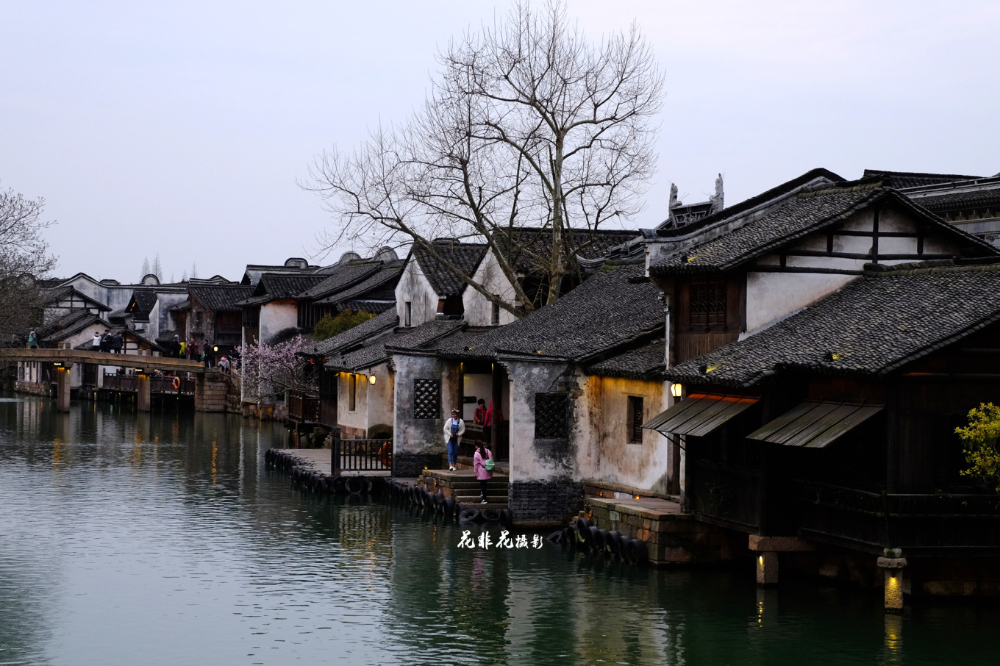
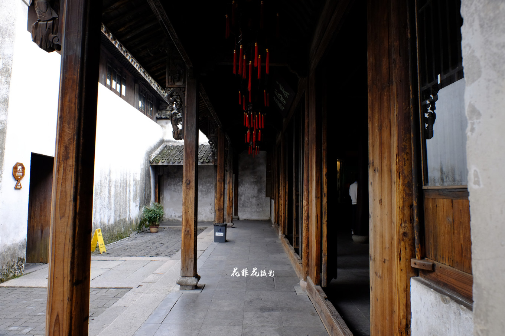

## 乌镇 | 让文青魂牵梦绕的“枕水人家”

> 走进乌镇，白墙黛瓦、小桥流水，眼前的一切都携着浓浓的中国水墨画气息扑面而来，雕梁画栋、石巷老屋，这个有“鱼米之乡，丝绸之府”之称的地方，自古就是文人墨客在此吟咏风月，畅怀叙谈的最爱，还是一代文豪茅盾的故乡。古镇有江南水乡中少有的水阁，也因此被称作是“中国最后的枕水人家”。“来过，便不曾离开”，这是刘若英的乌镇情怀。同样有这种情怀的，还有黄磊，因为热爱，他同他的小伙伴一起，在这里，发起了一年一度的戏剧节，也让“乌镇”成为了无数文青云牵梦绕的地方。有人说，如今经过统一改造的乌镇似乎因太过精致，少了一份历史的沧桑。然而，不能否认的是，那些属于吴越古镇的地方文化却被完整保留下来，熠熠生光。
> * **代表作**：《似水年华》、《美丽无声》、《旗袍》、《一江春水向东流》、《追日》、《早春二月》《乾隆王朝》、《她从海上来——张爱玲的故事》、《心中有鬼》
>* **著名景点**：宏源泰染坊、逢源双桥、桥里桥
>* **当地特产**：三白酒、蓝印花布、姑嫂饼、臭豆干、丝绵、白菊花

> * **地址**：浙江省嘉兴市桐乡市石佛南路18号