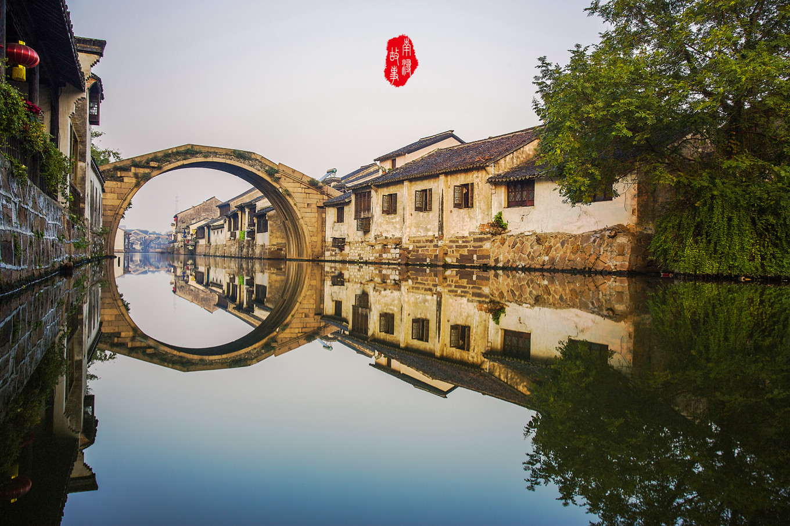
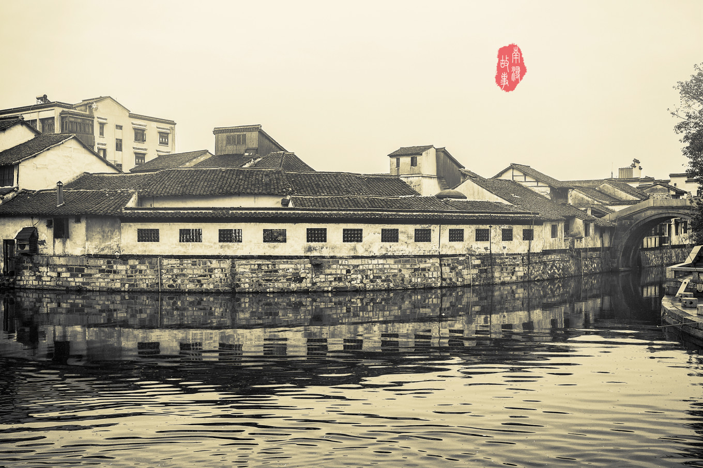

## 南浔 | 中西合璧的千年文化古镇

> 南浔，曾经最富庶的江南古镇，与其它古镇有所不同，这里少有老屋长廊、石桥深巷，却有很多名园古迹，且这些园子多有中西合璧的建筑风格，明代百间楼风貌奇特，清代张石铭和张静江故居别有情致。“一颦一笑”，都富有浓郁的文化气息。此外，这个拥有千年文化底蕴和历史传承的江南小镇还有各种可口的传统美食，热门美食综艺《十二道锋味》还曾专门做过一期“浔蹄”记，来南浔古镇体验地道的江南小吃。
> * **代表作**：《十二道锋味》、《钱塘人家》、《太平天国》、《天下粮仓》、《新上海滩》
> * **著名景点**：小莲庄、嘉业藏书楼、“南浔三古桥”
> * **当地特产**：南浔蹄、桔红糕、香大头菜、风枵、臭豆腐干、双交面、绣花锦菜

> * **地址**：浙江省湖州市南浔区城区以东（与江苏省苏州吴江市交界）