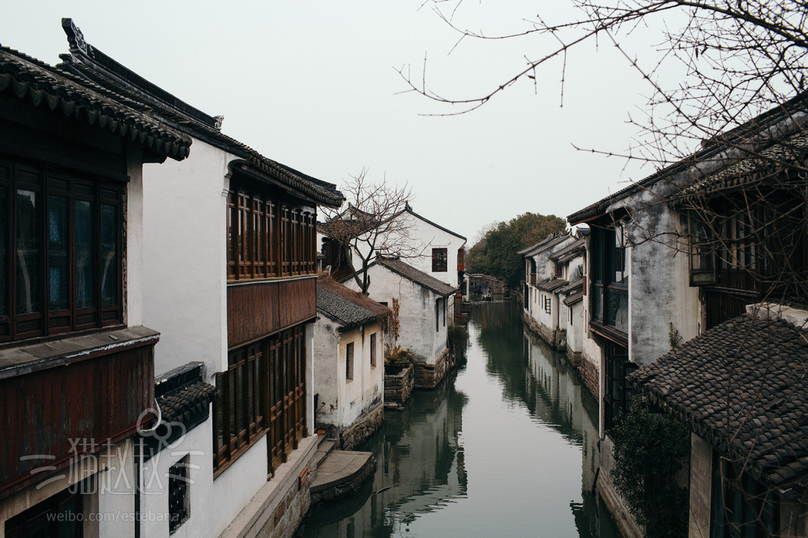
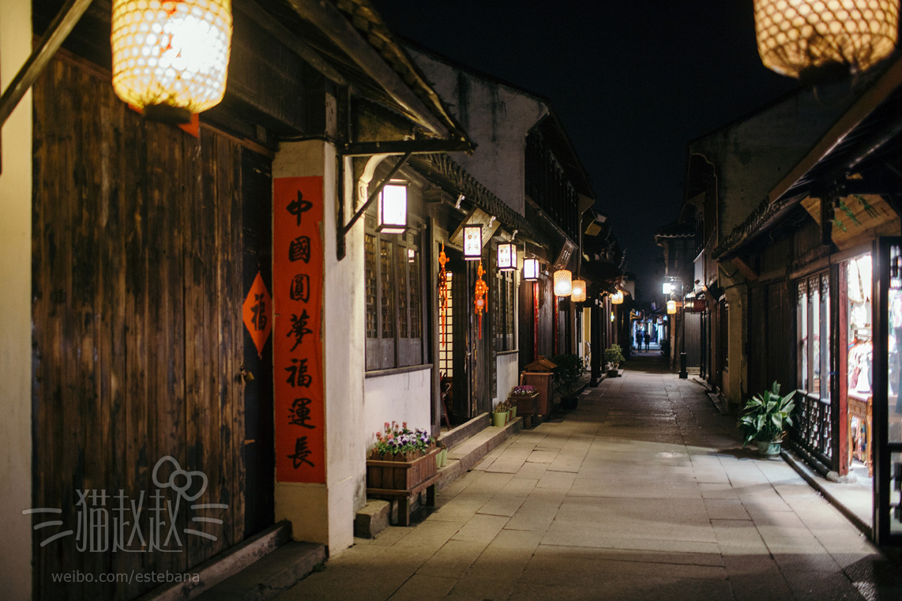

## 周庄 | 中国第一水乡

> “上有天堂，下有苏杭，中间有个周庄”。俏立于画家陈逸飞笔下的周庄，是江南六大古镇里开发最早、也最有名的水乡，有着“天下第一水乡”的美誉。这里因水成街，水滋润着周庄，水丰富着周庄，水是周庄的灵魂。古朴秀雅的明清民居，无限生机的流水，还有那充满岁月痕迹的石板桥，就这样“轿从前门进，船从家中过”，“小桥、流水、人家”完美地结合在一起，让你忍不住停留。
> * **代表作**：《新白娘子传奇》、《杨乃武与小白菜》、《聊斋书痴》、《阮玲玉》、《鸳鸯错配钱秀才》、《天若有情》、《济公游记》、《江南巨富沈万三》、《乾隆与香妃》、《华罗庚》、《新乱世佳人》
> * **著名景点**：富安桥、双桥、沈厅
> * **当地特产**：万三蹄、万三糕、莼菜、阿婆茶

> * **地址**：江苏省苏州市昆山市周庄镇全福路（与吴江、吴县、上海青浦县交界）