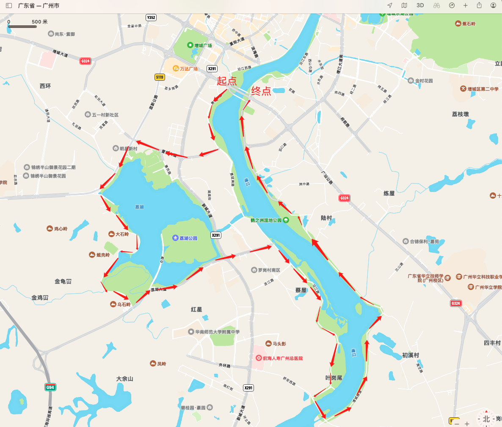

### 【计划中】2023.5.1~2023.5.2

* [增城天气预报☁️](http://waptianqi.2345.com/zengcheng-60368.htm)
* **骑行工具**： 共享单车🚴（购买7天3次卡 或 7天畅骑卡）
* **骑行景点🗺️**
    +   [荔湖公园](docs/增城荔湖景点.md)
    +   [鹤之洲湿地公园](docs/鹤之洲湿地公园.md)

#### DAY1（周一,2023.5.1）

##### 增江荔湖线
> `骑行路线`: 荔江国际->雁塔桥->沿江东路->鹤之洲绿道->初溪大桥->沿江绿道->荔湖湿地->二环路->荔湖碧道->万寿寺->天合路->荔新大道辅道->爱民大道->景观大道->荔江国际
[查看地图](#road_map)

#### DAY2（周二,2023.5.2）

路线图

---

* 🚴 生命不息，运动不止。