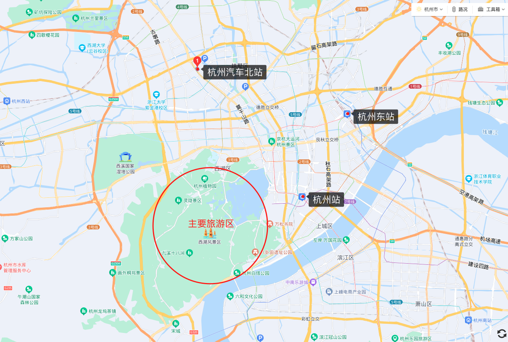
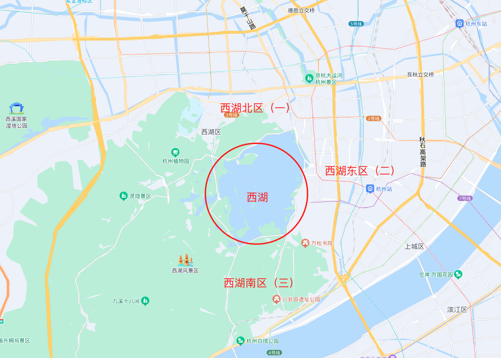
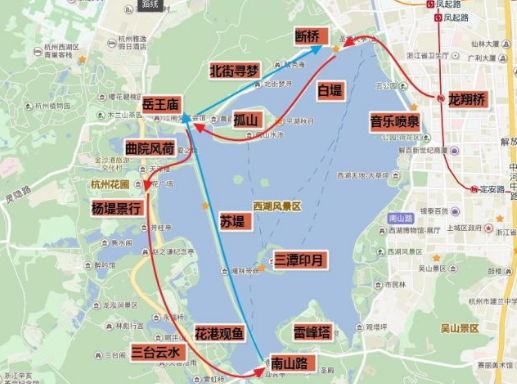

### 🚞景点：

* [西湖景区](西湖景区.md)
* [灵隐寺](灵隐寺.md)

### 西湖景区
#### 🚅交通
* **杭州主要交通站点位置图**
    
    > * 以西湖区为中心
        ▲ 半小时圈：杭州火车站（城站火车站）；
        ▲ 一小时圈：火车东站、杭州汽车北站；
        ▲ 两小时以上圈：杭州萧山机场。
    > * 如何到西湖风景区
        ▲ 火车东站：乘坐地铁1号线，最快；
        ▲ 杭州火车站（城站）：打车或者1号线都行；
        ▲ 汽车北站：公交188、k155；
        ▲ 萧山机场：乘坐机场大巴，到武林门或者乘坐地铁。
    > * 机场大巴
        ▲ 最晚一班机场大巴，随最晚一班飞机，即不管多晚，总有大巴把你送到市区。
        ▲ 萧山机场的机场大巴非常发达，除了到市区，还有到附近城市的。
        ▲ 市区的主要有武林门线、平海路（城站火车站）线、下沙线、火车东站线、滨江线、余杭线、火车东站线等。

#### 🏡住宿
* **西湖住宿区域**
    
    >   1. 杭州住宿以西湖为中心，分东、南、北三个方位。 
            ▲ 最推荐的是西湖东边的区域，交通最方便。以杭州火车站、南宋御街、河坊街附近为最佳。 
            ▲ 西湖北则住在断桥、浙大附近。 
            ▲ 西湖南边则推荐虎跑路、满陇桂雨附近。 
    >   2. 如果是旺季，推荐沿着地铁线找房，不要在西湖区内。 
    >   3. 杭州青旅价格随季节变化，平均是50元/人。旺季大概是60元/人。

#### ⚠️注意事项
>   * 带伞啊，带伞啊，带伞啊。不止遮阳，还可以挡雨啊。 
>   * 西湖晚上有时会比较凉，应带外套。
>   * 夜晚西湖边略有蚊虫。
>   * 不要轻信野导游，这份攻略你研究透了，基本上你也可以当导游了。而且只要你照着攻略玩，不会比导游带你玩的差。
>   * 手机保持有电，最好带个充电宝。因为你会随时开地图。请提前下好杭州地图。
>   * 在杭州各个店铺消费，尤其是喝茶，应做到先问价，再消费。（楼外楼普通茶叶7块一杯，好茶叶30块钱一杯，可以做一个参考。）
>   * 西湖周边吃饭的地方，杭帮菜去楼外楼、白鹿原、知味观等地，中午可以去岳王庙对面那里，晚上可以去河坊街。
>   * 一定要早起，一定要早起，一定要早起。重要的事情说三遍。早起的宝宝有美景看。六点起床，七点之前出门。如果你是小长假来，听话，不然你会被西湖的人挤哭。
>   * 路线中的景点，大家根据喜好酌情删加。
>   * 穿轻便的鞋子。运动鞋神马的最好，因为攻略大部分要步行的，而且石板路，底太薄的鞋子走长了特别伤脚。

#### 📝杭州景点科普
>   * 西湖之美，不只在西湖，更在西湖周边依据西湖衍生出的各个景点。
>   * 杭州好玩的地方集中在西湖区。西湖不需要门票。西湖周边景点有上百个，两三天之内全部走完是不可能的，这个攻略围是围绕着西湖“新旧十景”展开，同时插入个人觉得值得一去的景点。
>   * 西湖有十景之说，但是这十景其实一共经历了三次评选，所以西湖十景其实一共有三十景。
>   * 这30景可以看作是杭州景点之精华所在。其中以旧十景最为有名：**苏堤春晓、曲院风荷、平湖秋月、断桥残雪、柳浪闻莺、花港观鱼、雷峰夕照、双峰插云、南屏晚钟、三潭印月。**

#### 🛵路程安排
>   * 穷游和普通游路线（穷游只需删减部分花钱景点即可）。
>   * 每日行程大概在3万步左右，大家可以适当用共享单车代步。
>   * 第一天路线（8字路线）：
    
>   本路线全程十多公里，**南山路——苏堤——北山路**是夜景路线
