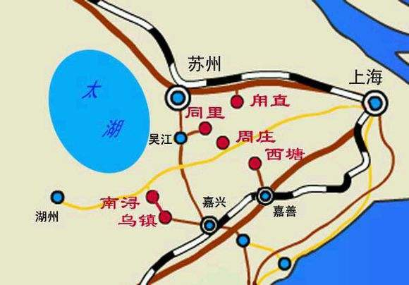

### 江南六大古镇
>周庄、同里、甪直、西塘、乌镇、南浔并称为江南六大古镇，是江南水乡古镇的典型代表，既“相同”又“不同”，且相距得都不算太远，三个在浙江，三个在苏州，地域分布主要集中在长三角洲，湖泊星罗棋布。
* 江南好，风景旧曾谙，日出江花红胜火，春来江水绿如蓝。能不忆江南？

* [周庄-中国第一水乡](周庄-中国第一水乡.md)
* [西塘-活着的千年古镇](西塘-活着的千年古镇.md)
* [乌镇-让文青魂牵梦绕的「枕水人家」](乌镇-让文青魂牵梦绕的「枕水人家」.md)
* [同里-东方小威尼斯.](同里-东方小威尼斯.md)
* [南浔-中西合璧的千年文化古镇](南浔-中西合璧的千年文化古镇.md)
* [甪直-江南的「桥都」](甪直-江南的「桥都」.md)

#### 江南六大古镇分布图

摘抄自:<https://www.mafengwo.cn/gonglve/ziyouxing/2381.html>
