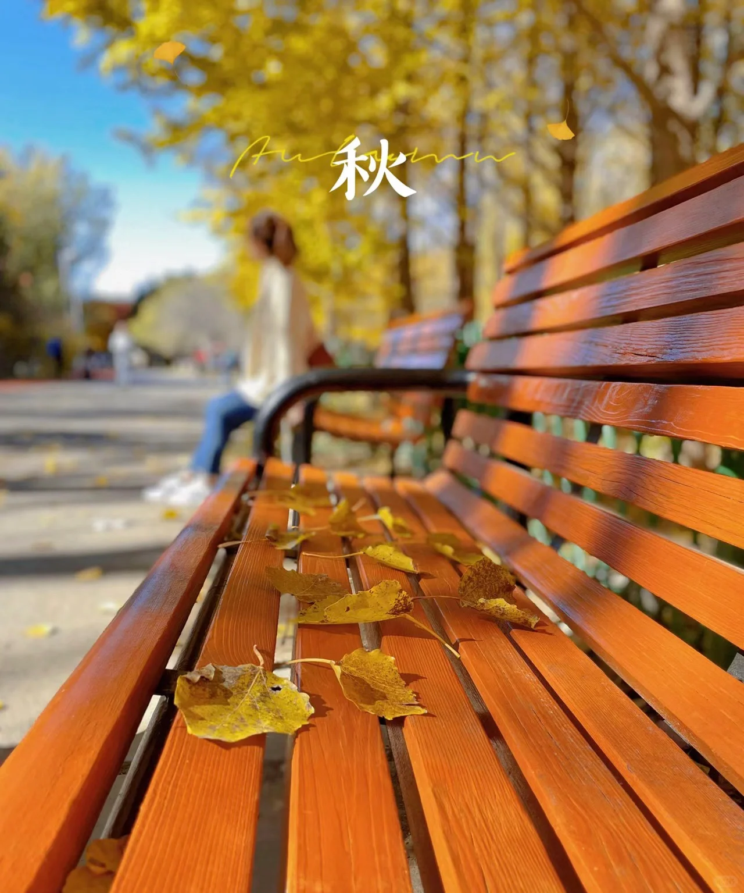

### 清远自驾游赏秋攻略【已完成】
📆时间：2023.12.2～12.3

>身在广州/深圳，你是否已厌倦了年复一年的花城绿色？是否也想体验或怀念北方的春夏秋冬？金秋时节，每一帧都是浪漫情调和收获的喜悦，周末去清远吧，那里藏着广东最美的秋天，你想要的浪漫和美好回忆那里都会实现！

[⛅清远天气预报](https://waptianqi.2345.com/qingyuan-59280.htm)

#### 2日计划行程【[🗺查看路线图](./subpage/清远攻略/路线图.md)】
+ [广州乐天便利店](https://map.baidu.com/mobile/webapp/place/detail/foo=bar&qt=ninf&wd=%E6%99%AF%E7%82%B9&c=131&searchFlag=sort&center_rank=1&nb_x=12630678.58&nb_y=2632363.00&da_src=unifynearbyclick&uid=ac6529665e6e0cd7c356ac27&industry=&qid=&pos=&da_ref=&da_qrtp=&da_adquery=&da_adtitle=%E4%B9%90%E5%A4%A9%E4%BE%BF%E5%88%A9%E5%BA%97&da_adindus=%E8%B4%AD%E7%89%A9;%E4%BE%BF%E5%88%A9%E5%BA%97&detail_from=list&vt=map) --> [英西峰林峰林晓镇](https://map.baidu.com/mobile/webapp/place/detail/foo=bar&qt=ninf&wd=%E6%99%AF%E7%82%B9&c=131&searchFlag=sort&center_rank=1&nb_x=12570973.85&nb_y=2750999.80&da_src=unifynearbyclick&uid=711420fdb5f528d100ff2d03&industry=&qid=&pos=&da_ref=&da_qrtp=&da_adquery=&da_adtitle=%E8%8B%B1%E8%A5%BF%E5%B3%B0%E6%9E%97%E5%B3%B0%E6%9E%97%E6%99%93%E9%95%87&da_adindus=%E6%97%85%E6%B8%B8%E6%99%AF%E7%82%B9;%E9%A3%8E%E6%99%AF%E5%8C%BA&detail_from=list&vt=map) --> [英西峰林画廊](https://map.baidu.com/mobile/webapp/place/detail/foo=bar&qt=ninf&wd=%E6%99%AF%E7%82%B9&c=131&searchFlag=sort&center_rank=1&nb_x=12569056.50&nb_y=2759399.01&da_src=unifynearbyclick&uid=b8ab5e86c38799f8bea2401b&industry=&qid=&pos=&da_ref=&da_qrtp=&da_adquery=&da_adtitle=%E8%8B%B1%E8%A5%BF%E5%B3%B0%E6%9E%97%E7%94%BB%E5%BB%8A&da_adindus=%E8%B4%AD%E7%89%A9&detail_from=list&vt=map) --> [小江银杏园](https://map.baidu.com/mobile/webapp/place/detail/foo=bar&qt=ninf&wd=%E6%99%AF%E7%82%B9&c=131&searchFlag=sort&center_rank=1&nb_x=12529580.17&nb_y=2815875.25&da_src=unifynearbyclick&uid=8abace002b0090fac16c1433&industry=&qid=&pos=&da_ref=&da_qrtp=&da_adquery=&da_adtitle=%E5%B0%8F%E6%B1%9F%E9%93%B6%E6%9D%8F%E5%9B%AD&da_adindus=%E6%97%85%E6%B8%B8%E6%99%AF%E7%82%B9;%E6%99%AF%E7%82%B9&detail_from=list&vt=map) --> （住宿：望山观景客栈）[南岗千年瑶寨](https://map.baidu.com/mobile/webapp/place/detail/qt=ninf&wd=%E5%8D%97%E5%B2%97%E5%8D%83%E5%B9%B4%E7%91%B6%E5%AF%A8%E6%99%AF%E5%8C%BA&c=1&searchFlag=bigBox&version=5&exptype=dep&src_from=webapp_all_bigbox&wd2=%E6%B8%85%E8%BF%9C%E5%B8%82%E8%BF%9E%E5%8D%97%E7%91%B6%E6%97%8F%E8%87%AA%E6%B2%BB%E5%8E%BF&sug_forward=a7cece88157833e07c29bda7&src=1&uid=a7cece88157833e07c29bda7&industry=scope&qid=3392985892836739131/showall=1&pos=0&da_ref=listclk&da_qrtp=11&da_adtp=&da_log=&da_adquery=%E5%8D%97%E5%B2%97%E5%8D%83%E5%B9%B4%E7%91%B6%E5%AF%A8%E6%99%AF%E5%8C%BA&da_adtitle=%E5%8D%97%E5%B2%97%E5%8D%83%E5%B9%B4%E7%91%B6%E5%AF%A8%E6%99%AF%E5%8C%BA&da_adindus=%E6%97%85%E6%B8%B8%E6%99%AF%E7%82%B9;%E9%A3%8E%E6%99%AF%E5%8C%BA&detail_from=list) --> [罗汉村](https://map.baidu.com/mobile/webapp/place/detail/foo=bar&qt=ninf&wd=%E6%99%AF%E7%82%B9&c=131&searchFlag=sort&center_rank=1&nb_x=12533854.30&nb_y=2817740.97&da_src=unifynearbyclick&uid=264bab436003373195f08c2b&industry=&qid=&pos=&da_ref=&da_qrtp=&da_adquery=&da_adtitle=%E7%BD%97%E6%B1%89%E6%9D%91&da_adindus=%E8%A1%8C%E6%94%BF%E5%9C%B0%E6%A0%87;%E6%9D%91%E5%BA%84&detail_from=list&vt=map) --> [下元福](https://map.baidu.com/mobile/webapp/place/detail/foo=bar&qt=ninf&wd=%E6%99%AF%E7%82%B9&c=131&searchFlag=sort&center_rank=1&nb_x=12530594.65&nb_y=2824265.40&da_src=unifynearbyclick&uid=c61bd305d789eb68c27da20f&industry=&qid=&pos=&da_ref=&da_qrtp=&da_adquery=&da_adtitle=%E4%B8%8B%E5%85%83%E7%A6%8F&da_adindus=%E8%A1%8C%E6%94%BF%E5%9C%B0%E6%A0%87;%E6%9D%91%E5%BA%84&detail_from=list&vt=map) --> [看坪村](https://map.baidu.com/mobile/webapp/place/detail/foo=bar&qt=ninf&wd=%E6%99%AF%E7%82%B9&c=131&searchFlag=sort&center_rank=1&nb_x=12531056.57&nb_y=2824826.28&da_src=unifynearbyclick&uid=101bc61bde9309a3c42ba10f&industry=&qid=&pos=&da_ref=&da_qrtp=&da_adquery=&da_adtitle=%E7%9C%8B%E5%9D%AA&da_adindus=%E8%A1%8C%E6%94%BF%E5%9C%B0%E6%A0%87;%E6%9D%91%E5%BA%84&detail_from=list&vt=map) --> 广州乐天便利店(返程)
+ Tips：
    - 还是开发好的景区附近住宿条件比较好，所以选千年瑶寨

#### 🚙自驾路程路线
+ ~~🚄高铁：深圳北 --`29分钟，¥74.5/人`--> 广州南~~
+ 🚕哈啰顺风车：**固戍地铁F口🚉** --全程92.1km，约`1小时14分钟`，2人约`¥113.2`--> **乐天便利店🏪**
+ 🚗自驾第一天： **乐天便利店🏪** --`约2小时15分钟`--> **英西峰林峰林晓镇🏘️**（午饭） --`约1小时47分钟`--> **小江银杏园🏞**（麦屋村） --`约1小时7分钟`--> **南岗千年瑶寨🏨**（住宿：望山观景客栈）
+ 🚗自驾第二天： **南岗千年瑶寨🏨** -->`约4小时`--> **广州乐天便利店🏪**
+ 🚕哈啰顺风车：**乐天便利店🏪** --约`1小时14分钟`，2人约`¥201`--> **固戍地铁F口🚉**

#### 住宿
+ [望山观景客栈](https://map.baidu.com/mobile/webapp/search/search/qt=s&wd=%E8%BF%9E%E5%8D%97%E5%8D%83%E5%B9%B4%E7%91%B6%E5%AF%A8%E6%9C%9B%E5%B1%B1%E8%A7%82%E6%99%AF%E5%AE%A2%E6%A0%88&c=1596&searchFlag=bigBox&version=5&exptype=dep&src_from=webapp_all_bigbox&sug_forward=03aad214f7c63b57f33cba08&src=2/vt=map)
    - 📍地点：清远连南县三排镇南岗千年瑶寨景区内
    - ☎️电话：13416533048
    - 💰参考价：￥178+¥200（5人）

#### 打卡景点
+ [南岗千年瑶寨](https://map.baidu.com/mobile/webapp/place/detail/qt=ninf&wd=%E5%8D%97%E5%B2%97%E5%8D%83%E5%B9%B4%E7%91%B6%E5%AF%A8%E6%99%AF%E5%8C%BA&c=1&searchFlag=bigBox&version=5&exptype=dep&src_from=webapp_all_bigbox&wd2=%E6%B8%85%E8%BF%9C%E5%B8%82%E8%BF%9E%E5%8D%97%E7%91%B6%E6%97%8F%E8%87%AA%E6%B2%BB%E5%8E%BF&sug_forward=a7cece88157833e07c29bda7&src=1&uid=a7cece88157833e07c29bda7&industry=scope&qid=3392985892836739131/showall=1&pos=0&da_ref=listclk&da_qrtp=11&da_adtp=&da_log=&da_adquery=%E5%8D%97%E5%B2%97%E5%8D%83%E5%B9%B4%E7%91%B6%E5%AF%A8%E6%99%AF%E5%8C%BA&da_adtitle=%E5%8D%97%E5%B2%97%E5%8D%83%E5%B9%B4%E7%91%B6%E5%AF%A8%E6%99%AF%E5%8C%BA&da_adindus=%E6%97%85%E6%B8%B8%E6%99%AF%E7%82%B9;%E9%A3%8E%E6%99%AF%E5%8C%BA&detail_from=list)：一座原汁原味的少数民族古村落，距今已有一千四百多年的历史，古寨依山而建，寨内保留有398幢古建筑。
+ [看坪村](https://map.baidu.com/mobile/webapp/place/detail/foo=bar&qt=ninf&wd=%E6%99%AF%E7%82%B9&c=131&searchFlag=sort&center_rank=1&nb_x=12531056.57&nb_y=2824826.28&da_src=unifynearbyclick&uid=101bc61bde9309a3c42ba10f&industry=&qid=&pos=&da_ref=&da_qrtp=&da_adquery=&da_adtitle=%E7%9C%8B%E5%9D%AA&da_adindus=%E8%A1%8C%E6%94%BF%E5%9C%B0%E6%A0%87;%E6%9D%91%E5%BA%84&detail_from=list&vt=map)：千年古银杏群和青砖黛瓦民居、小池塘、村巷交相辉映，每一帧都是古香古色的田园诗画。
+ [罗汉村](https://map.baidu.com/mobile/webapp/place/detail/foo=bar&qt=ninf&wd=%E6%99%AF%E7%82%B9&c=131&searchFlag=sort&center_rank=1&nb_x=12533854.30&nb_y=2817740.97&da_src=unifynearbyclick&uid=264bab436003373195f08c2b&industry=&qid=&pos=&da_ref=&da_qrtp=&da_adquery=&da_adtitle=%E7%BD%97%E6%B1%89%E6%9D%91&da_adindus=%E8%A1%8C%E6%94%BF%E5%9C%B0%E6%A0%87;%E6%9D%91%E5%BA%84&detail_from=list&vt=map)：有18棵千年银杏，姿态婆娑直冲云霄。
+ [下元福村](https://map.baidu.com/mobile/webapp/place/detail/foo=bar&qt=ninf&wd=%E6%99%AF%E7%82%B9&c=131&searchFlag=sort&center_rank=1&nb_x=12530594.65&nb_y=2824265.40&da_src=unifynearbyclick&uid=c61bd305d789eb68c27da20f&industry=&qid=&pos=&da_ref=&da_qrtp=&da_adquery=&da_adtitle=%E4%B8%8B%E5%85%83%E7%A6%8F&da_adindus=%E8%A1%8C%E6%94%BF%E5%9C%B0%E6%A0%87;%E6%9D%91%E5%BA%84&detail_from=list&vt=map)：有20几棵百年银杏，银杏、乡间小路、老房子.....画面很美。

#### 备选景点 
+ [大东山温泉](https://map.baidu.com/mobile/webapp/place/detail/foo=bar&qt=ninf&wd=%E6%99%AF%E7%82%B9&c=131&searchFlag=sort&center_rank=1&nb_x=12538305.82&nb_y=2840039.99&da_src=unifynearbyclick&uid=5bb37075aa1944e3dbd891d6&industry=&qid=&pos=&da_ref=&da_qrtp=&da_adquery=&da_adtitle=%E8%BF%9E%E5%B7%9E%E5%B8%82%E5%A4%A7%E4%B8%9C%E5%B1%B1%E6%B8%A9%E6%B3%89%E5%BA%A6%E5%81%87%E5%8C%BA&da_adindus=%E4%BC%91%E9%97%B2%E5%A8%B1%E4%B9%90;%E5%BA%A6%E5%81%87%E6%9D%91&detail_from=list&vt=map)：梳状矿泉水水质，呈自然状态。
+ [潭岭天湖](https://map.baidu.com/mobile/webapp/place/detail/foo=bar&qt=ninf&wd=%E6%99%AF%E7%82%B9&c=131&searchFlag=sort&center_rank=1&nb_x=12541736.88&nb_y=2854358.85&da_src=unifynearbyclick&uid=3391cbff62f5f538744ff177&industry=&qid=&pos=&da_ref=&da_qrtp=&da_adquery=&da_adtitle=%E6%BD%AD%E5%B2%AD%E5%A4%A9%E6%B9%96&da_adindus=%E6%88%BF%E5%9C%B0%E4%BA%A7;%E4%BD%8F%E5%AE%85%E5%8C%BA&detail_from=list&vt=map)：湖水清澈如镜，小岛和猴子多。
+ [黑山梯田](https://map.baidu.com/mobile/webapp/place/detail/foo=bar&qt=ninf&wd=%E6%99%AF%E7%82%B9&c=131&searchFlag=sort&center_rank=1&nb_x=12486609.34&nb_y=2827279.06&da_src=unifynearbyclick&uid=757d1b8be3c9a8ef96ca078a&industry=&qid=&pos=&da_ref=&da_qrtp=&da_adquery=&da_adtitle=%E9%BB%91%E5%B1%B1%E6%A2%AF%E7%94%B0&da_adindus=%E6%97%85%E6%B8%B8%E6%99%AF%E7%82%B9&detail_from=list&vt=map)：景色不输欧家梯田，费用也低
+ [油岭瑶寨](./subpage/清远攻略/古村落.md)：比千年瑶寨性价比高，更原始，费用也低。
+ [茶山村](https://map.baidu.com/mobile/webapp/place/detail/foo=bar&qt=ninf&wd=%E6%99%AF%E7%82%B9&c=131&searchFlag=sort&center_rank=1&nb_x=12649884.50&nb_y=2770458.21&da_src=unifynearbyclick&uid=87248d962aeb87b32806ce29&industry=&qid=&pos=&da_ref=&da_qrtp=&da_adquery=&da_adtitle=%E8%8C%B6%E5%B1%B1&da_adindus=%E8%A1%8C%E6%94%BF%E5%9C%B0%E6%A0%87;%E6%9D%91%E5%BA%84&detail_from=list&vt=map)：即网红小江银杏园，有上千棵人工林。
+ [高山村](https://map.baidu.com/mobile/webapp/place/detail/foo=bar&qt=ninf&wd=%E6%99%AF%E7%82%B9&c=131&searchFlag=sort&center_rank=1&nb_x=12528985.00&nb_y=2822340.00&da_src=unifynearbyclick&uid=49759ac04bd621f1230262ab&industry=&qid=&pos=&da_ref=&da_qrtp=&da_adquery=&da_adtitle=%E9%AB%98%E5%B1%B1%E6%9D%91&da_adindus=%E8%A1%8C%E6%94%BF%E5%9C%B0%E6%A0%87;%E6%9D%91%E5%BA%84&detail_from=list&vt=map)：一座座白色的风车与蓝天、落日绘出一道美丽风景线。
+ [清江村](https://map.baidu.com/mobile/webapp/place/detail/foo=bar&qt=ninf&wd=%E6%99%AF%E7%82%B9&c=131&searchFlag=sort&center_rank=1&nb_x=12526775.11&nb_y=2864947.05&da_src=unifynearbyclick&uid=850815e114c7f79b43e1920b&industry=&qid=&pos=&da_ref=&da_qrtp=&da_adquery=&da_adtitle=%E6%B8%85%E6%B1%9F%E6%9D%91&da_adindus=%E8%A1%8C%E6%94%BF%E5%9C%B0%E6%A0%87;%E6%9D%91%E5%BA%84&detail_from=list&vt=map)：数百棵百年银杏树盛开如田园画卷。
+ [田野绿世界](https://map.baidu.com/mobile/webapp/place/detail/foo=bar&qt=ninf&wd=%E6%99%AF%E7%82%B9&c=131&searchFlag=sort&center_rank=1&nb_x=12625654.39&nb_y=2722911.90&da_src=unifynearbyclick&uid=2ad32cc3dd1c73f29d95dee8&industry=&qid=&pos=&da_ref=&da_qrtp=&da_adquery=&da_adtitle=%E7%94%B0%E9%87%8E%E7%BB%BF%E4%B8%96%E7%95%8C&da_adindus=%E4%BC%91%E9%97%B2%E5%A8%B1%E4%B9%90;%E5%BA%A6%E5%81%87%E6%9D%91&detail_from=list&vt=map)：七公里枫叶林如油画世界。

#### 拍照攻略
+ 服装：白、红、黑、蓝、浅咖等现代简约、复古中、长裙，汉服最佳。
+ 拍摄：情景人像为主易出大片，中景及特写镜头易突出人物美感。

#### 美食攻略：
* **苦斋菜汤**，瑶族人平时会采集野生苦斋、木耳、竹笋做菜，苦斋菜汤非常清淡，其味鲜苦甘清香。
* **瑶家自酿的米酒**，瑶族人喜欢酿造米酒，这种酒清澈透亮，醇香可口，瑶族特色的绿色食材晚宴———千人生态长桌宴，会上有瑶家自酿的米酒供客人品尝。
* **自制腐竹**，瑶族人民喜欢吃腐竹，腐竹的吃法很多，可以炸炖炒焖。在歌堂坪参观时，可以品尝到加入了黄花菜混煮的腐竹，色泽鲜美、香味扑鼻、嫩滑、特别有风韵的一道瑶族佳肴。
* **瑶老酸笋**，这是瑶族传统美食之一。酸笋属于青橙宜家果实，口感酸爽爽的，这道菜的制作是将酸笋切碎，加些猪肉，香菇一起炒炖。这道菜不仅味美可口，还具有一定的营养价值，被当地人誉为“山珍海味”。
* **瑶族烤猪肉**，是瑶寨的一道传统美食，原材料选用当地的野猪肉，烤熟后再配上一钵新鲜的辣椒酱，味道十分鲜美。这道菜是瑶族人除了过年，婚礼等重要场合，必不可少的美食。
* **瑶族竹米饭**，在瑶寨，可以尝到一种特别的米粒，叫做竹良米。这是一种有机种植的米，煮熟后口感十分有弹性，搭配各种菜品都特别好吃。瑶族竹米饭用竹良米煮制而成，是瑶族人日常的主食之一，口感很好，有助于增加身体的营养。

#### 观赏时间
+ [🍂银杏](./subpage/清远攻略/银杏.md)：11-12月初
+ [🍁枫叶](./subpage/清远攻略/枫叶.md)：12-1月中
+ [🌾稻田](./subpage/清远攻略/田园风光.md)：10中-11月中
+ 粉黛：9中-11月中

#### 门票参考
+ 罗汉村：¥48，含罗汉塘村+茶山村（小江银杏园）
+ 峰林晓镇：¥68
+ 千年瑶寨：¥106

#### **Tips**
+ 大部分景点晴天较晒，注意防晒
+ 十二月清远气温较低，注意看天气预报，带保暖衣服。
+ 村落较偏，餐饮少且较坑，建议自备中餐

---

**秋天文案𝒜𝓊𝓉𝓊𝓂𝓃‧🍁₊**

* 🍂 银杏黄了¨̮ 一筐十二月𓋒
* 🍂 𝘼𝙪𝙩𝙪𝙢𝙣 𝙙𝙚𝙗𝙧𝙞𝙨 ✧🍊🍁 “关于秋天 我都想记录”
* 🍂 𓂃 🍂𓂃ᐝ “喜欢慢悠悠的日子和真诚的人”
* 🍂 ｜𝙁𝙖𝙡𝙡 𝙞𝙣 𝘼𝙪𝙩𝙪𝙢𝙣 “云天收夏色 木叶动秋声”
* 🍂 𝑯𝒆𝒍𝒍𝒐 𝑨𝒖𝒕𝒖𝒎𝒏 ”风与枯叶 秋日人间“
* 🍂 𝒜𝓊𝓉𝓊𝓂𝓃‧🍁₊✧希望我们的往后日子顺风顺水又顺意
* 🍁 人间朝暮，叶落惊秋
* 🍁 人烟寒橘柚，秋色老梧桐
* 🍁 喜欢生活里每一处有光的地方
* 🍁 热爱生活的人，都会被温暖包围
* 🍁 想把关于美好的日子，过得慢一点
* 🍁 烂漫不过秋日花，慢煮光阴一壶茶
* 🍁 人间灯火无不休，爱与山水与春秋
* 🍁 一晃又一秋，收集与秋天邂逅的日子
* 🍁 秋天的故事也会像枫叶一样五彩缤纷吧
* 🍁 时间在院子里结了果，秋风为它上暖色
* 🍁 忘掉夏天种过的花，去爱秋天有结果的树
* 🍁 将岁月的箴言，藏于一枚秋叶，风起时自有答案
* 🍁 清风送夏远，舒云卷秋来；清风知我意，微凉且深情
* 🍁 行至朝雾里，坠入暮云间；尚言繁花落，不知秋风起
* 🍁 转眼夏天便成了故事，秋天成了风景，冬天成了期待
* ☀️秋天的阳光不再像夏天那样刺眼，伸手挡住眼睛，然后慢慢伸直手臂，五指分开。在手指的缝隙间里静静地享受阳光，那份独特宠爱的温暖，舒适的、适度的、祥瑞的。秋天，我们要走的更稳一些，别再回头了，剩下的就留在盛夏
* 🌅 心存阳光，必有诗和远方。
* 🌠 没人的照片是风景，有人的照片是回忆。
* 🌆 生活需要仪式感，就像平淡的生活需要束光。
* 🌃 用不旅行的日子供给着旅行的时光，用旅行的时光营养着不旅行的日子，生活就变的规律而美好了。

**十二月文案⛄**
* ❄️ 好像，所有故事，都发生在春夏秋。因为，十二月充满期待
* ❄️ 愿时光能缓，愿故人不散，愿你惦念的人，都能和你道：晚安
* ❄️ 人间冬日，山河温柔；一草一木，自在欢喜；愿你我晨昏无恙，岁月不惊
* ❄️ 烟火人间，光阴阑珊；年华的脚步渐行渐远；愿我们心存热望，温良恬淡
* ❄️ 给时间时间，让过去过去，让开始开始。十二月，愿我们不争不抢，却有岁月打赏
* ❄️ 时光匆匆又是冬，岁月悠悠又一年，但愿你我在清浅的岁月里，三冬温暖，一世平安
* ❄️ 十二月，旧岁将末，冬酿时光；愿你我保持热爱，成为自己的太阳
* ❄️ 十二月，孟冬在野，仲冬在望；慢赏晴花，细品风月；认真生活，笑对流年
* ❄️ 十二月，时光荏苒，莫负韶华。让我们淡化薄凉，融化忧伤，一路向暖，静待花开……
* ❄️ 十二月的风吹得很紧，连时间都站不稳脚跟，吹拂着萧瑟荒芜的天地，慌忙地变换着人间的光景

> 人民日报说：“能拍就拍，能照就照，想炫耀的一定要去炫，十年后再好的相机和技术，也拍不出如此般模样，大胆的记录生活，你现在的每一天都是值得被收藏“。
> 这大概也是很多摄影爱好者们，永不停止记录的原因，别总抱怨生活不如意，也别总低头自怨自艾，多抬头看周围的风景，甚至把目光投射向你梦想的远方，人有了喜欢的事情，灵魂就有了栖息之地。
> 总觉得人们对于秋天的记录，当如同永不停歇的脚步，能见室外的灿烂，也能见室内的温柔日常，看见光影会赞叹，看见可口的食物会欣喜，看见某个被阳光拥抱角落会幸福，看见那些用心记录的人会共情。
> 秋天，好好生活吧，甚至出走大自然，去感受自然的意趣。

