### 灵隐寺
* 毗邻西湖，是中国最早的佛教寺院和中国十大古刹之一，留存着各朝代众多精美文物。
* 天王殿上悬“云林禅寺”匾额，为清康熙帝所题，寺内宝物汇集。
* 山上有许多奇幻多变的洞壑，遍布五代以来的佛教石窟造像，是我国江南少见的古代石窟艺术瑰宝。
* 这里是济公的出家地，据说求愿很灵验，每天来礼佛祈福的香客络绎不绝。

>Tips：
> * 灵隐寺检票处为每一位香客免费赠送三支清香，是不需要额外购买的。
> * 寺庙大殿内都是禁止拍摄的，希望大家能尊重灵隐寺的规定，不要在没有经过允许的情况下，在大殿内进行拍摄。

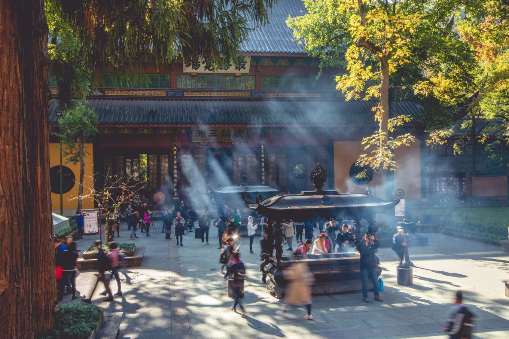
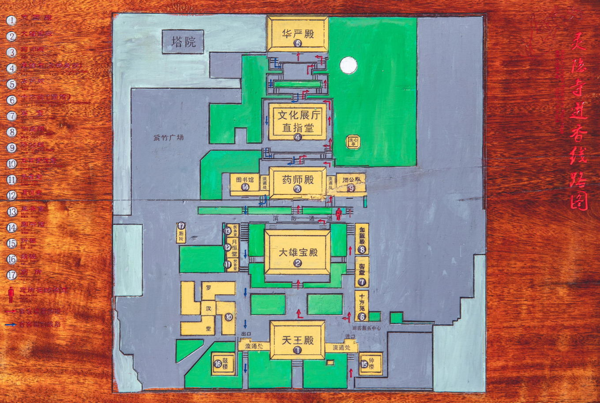

**常规的浏览方式:`天王殿->大雄宝殿->观音殿->药师殿->济公殿->直指堂->华严殿->罗汉殿->伽蓝殿`**

### 天王殿
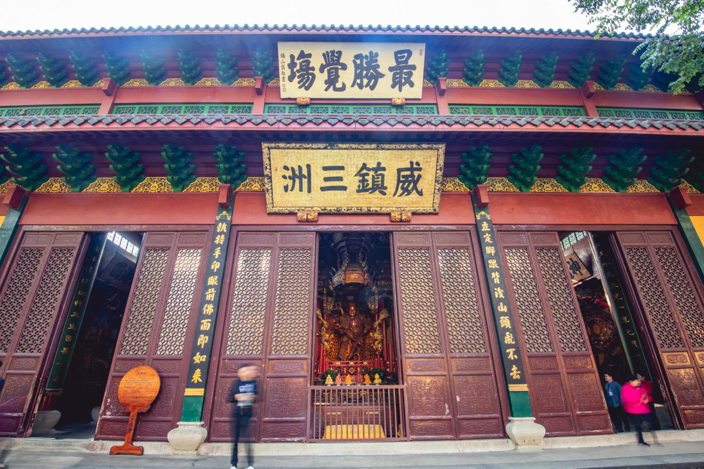
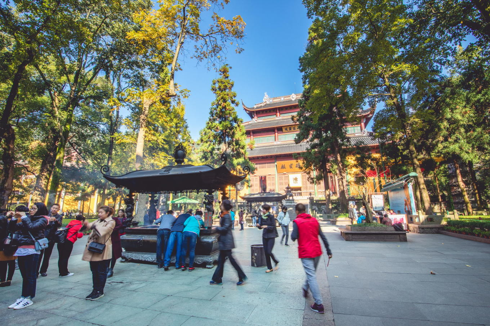
### 大雄宝殿
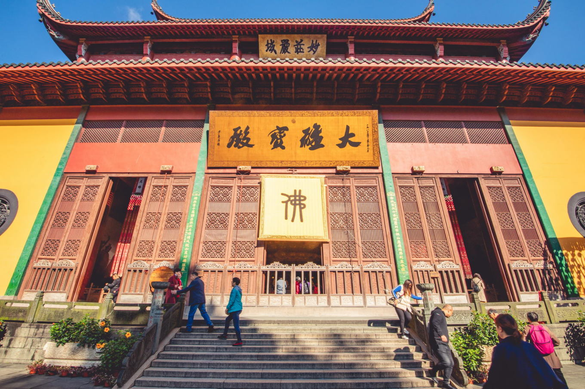
### 观音殿

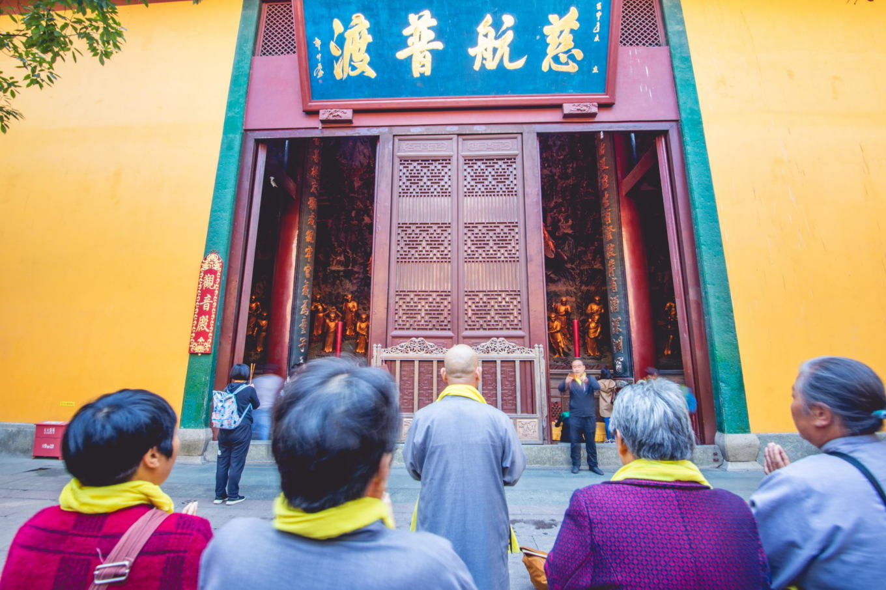
### 药师殿
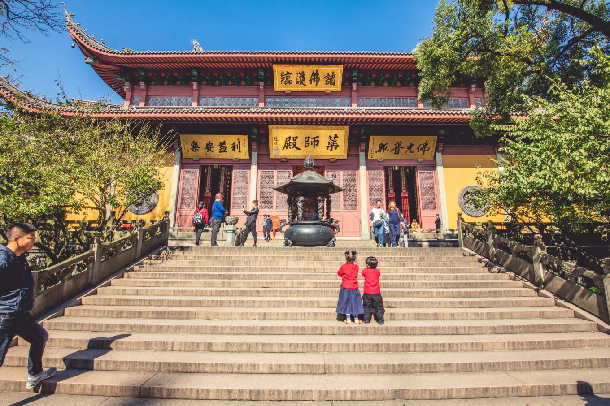
### 济公殿
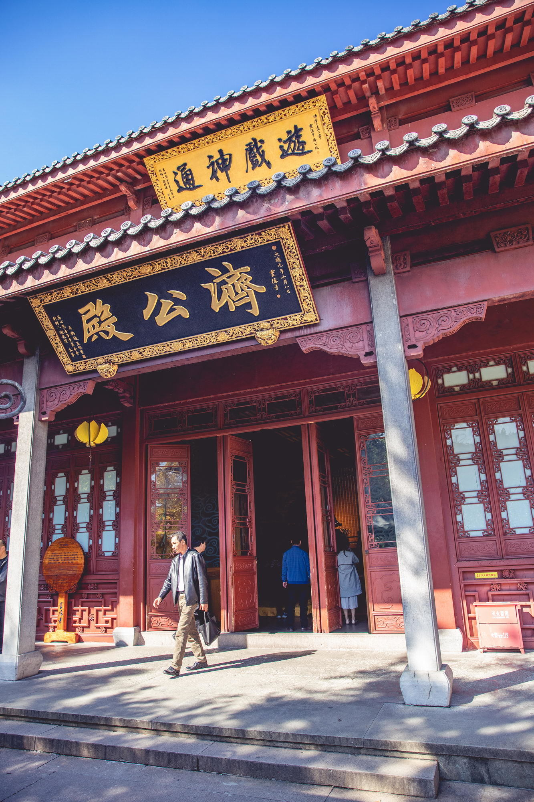
### 直指堂
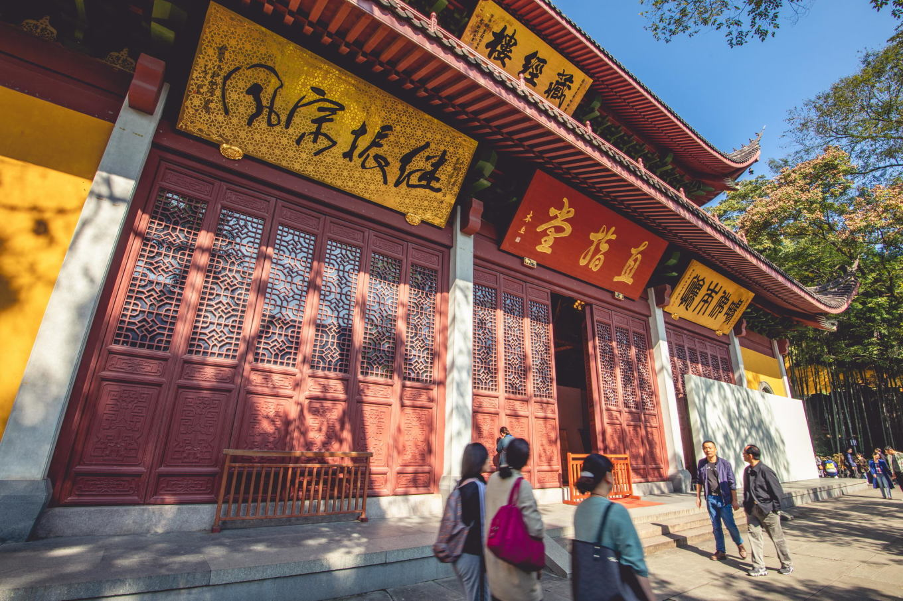
### 华严殿
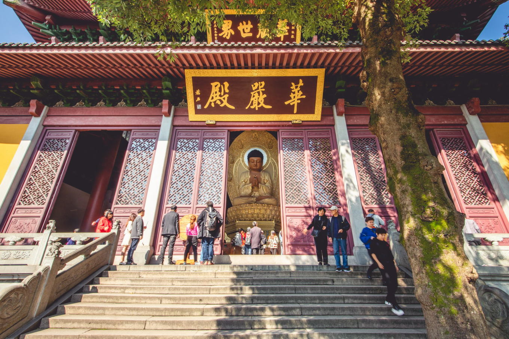
### 罗汉殿

### 伽蓝殿
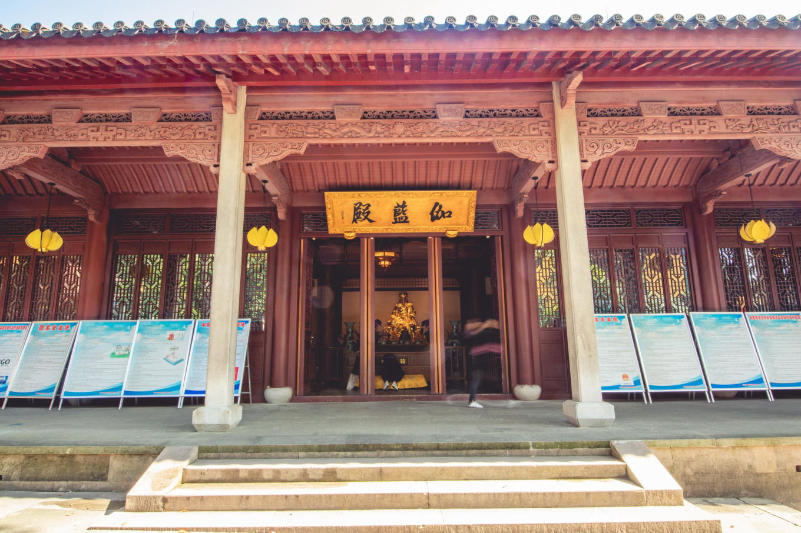

