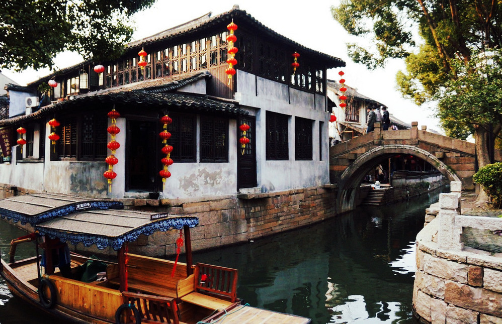
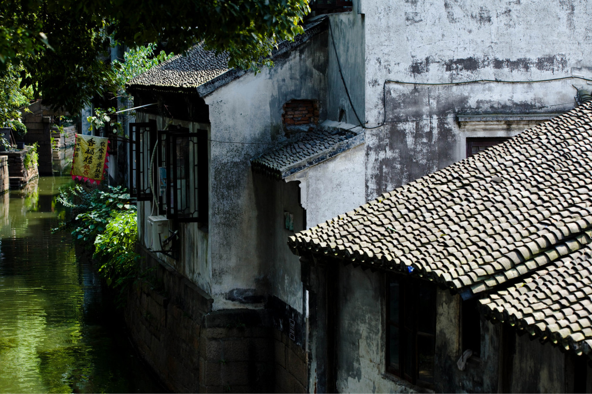

## 甪直 | 江南的"桥都"

> 苏州城东三十六里，有一个具有浓郁水乡风情的古镇，这就是被著名社会学家费孝通先生誉为“神州水乡第一镇”的甪（lù）直镇。虽然它的声名没有周庄、乌镇那么响亮，但它的水乡风貌、历史底蕴完全不输于其他。有人说，甪直是江南的“桥都”，走进甪直，你会发现此言不虚，这个具有醇正的江南水乡特色的古镇，以水多，桥多而著称，据说，甪直桥的密度堪称“世界之最”。镇上河水清清，环境幽雅，那些名胜古迹、古桥、古街、古宅以及具有1300多年历史的古银杏树都令人甚为向往，见者皆赞叹不已。
> * **代表作**：《西游记》、《红楼梦》、《围城》、《洒向人间都是爱》、《玫瑰旋涡》
> * **著名景点**：保圣寺、银杏树、沈宅、萧宅
> * **当地特产**：甫里蹄、甫里鸭、萝卜干、酱瓜

> * **地址**：江苏省苏州市吴中区晓市路