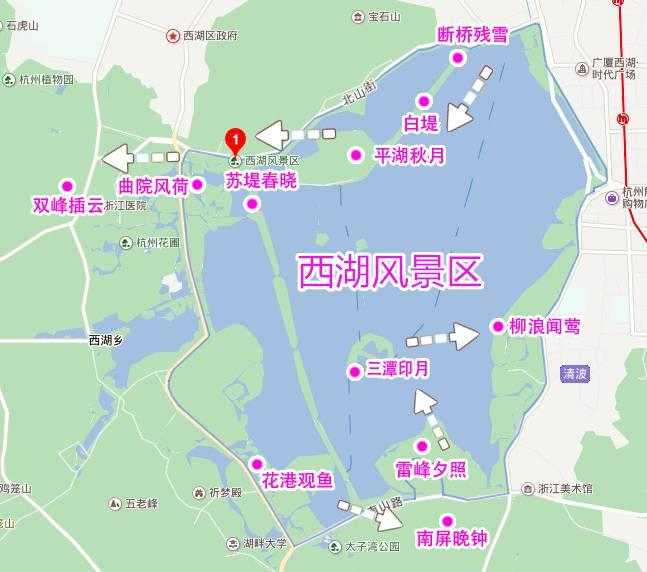
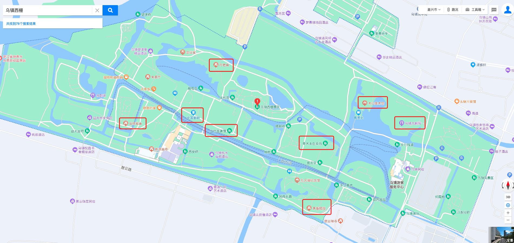
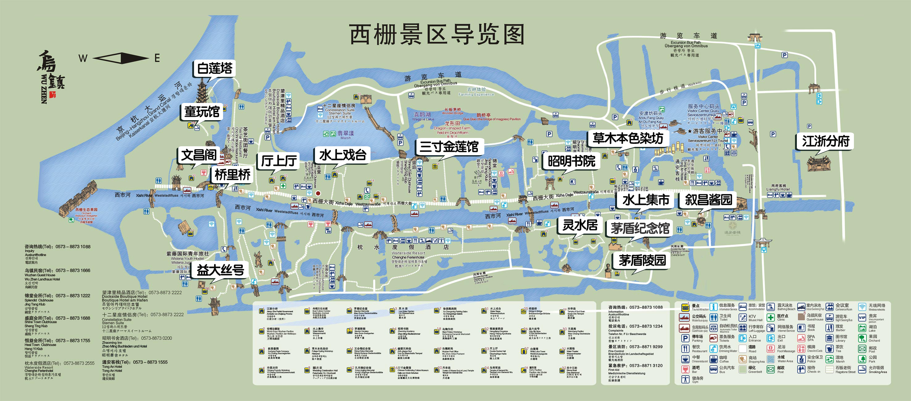

### 【计划中】

**三天三晚到行程大致安排**：
+ **[前一晚](#day0)** 深圳宝安飞机出发到杭州
+ **[第一天](#day1)** 西湖景区游玩
+ **[第二天](#day2)** 从西湖出发到乌镇（中午）
+ **[第三天](#day3)** 乌镇到机场返回深圳宝安

1. [西湖景区地图](#xihu_map)
2. [镇西栅地图](#wuzhen_map)

* tips: 
    1. 杭州音乐喷泉开放时间为**周六、周日**
    2. 木心美术馆**周一**闭馆

### 准备：
+ 查询目的地天气情况（确定行程后）
    - [西湖天气预报☁️](http://waptianqi.2345.com/xihu-71854.htm)
    - [乌镇天气预报☁️](http://waptianqi.2345.com/zhejiang-wuzhenzhen/31166.htm)
+ [清点行李清单](旅行准备.md)
+ 交通安排（提前订票 **【飞机/高铁/火车】**）
+ 住宿安排（提前预订）

### **DAY0：**
#### [交通](#traffic1)
* **深圳宝安机场🛫** --`「约2小时」`--> **杭州萧山机场🛬**

#### 住宿（第2晚）
##### 杭州路曼酒店
* 📍地点：浙江省杭州市靖江街道青六南路900号
* ☎️电话：+8613336120158

#### 预算
* 交通：
    + ✈飞机：¥1733（2人，深圳宝安机场->杭州萧山机场）
    + 🚖打车：¥73（接机，机场->杭州曼璐酒店）
* 吃住：
    + 🏨杭州曼璐酒店：¥0（机票绑定）
* 其他：无

### **DAY1：**

>   1. 杭州曼璐酒店 --> 住宿地🏠 --> 西湖景区游玩（路线计划中）--> 晚上看西湖灯光秀(音乐喷泉)
>   2. [2023苏州音乐喷泉开放时间表](http://suzhou.bendibao.com/tour/2022812/102320.shtm)

#### [交通](#traffic1)
* **杭州曼璐酒店🏨** --`地铁🚇`--> **杭州逆光民宿🏠**
    + 永盛路站 ->`地铁19号线（苕溪方向，7站）`->西湖文化广场站(换线)->`地铁3号线（吴山前村方向，3站）`-->黄龙体育中心站（D口出）-->`打车🚖或公交🚌(79路)`-->杭州逆光民宿

#### 住宿（第2晚）

##### [杭州逆光民宿](docs/杭州逆光民宿.md)
* 📍地点：浙江省杭州市西湖区玉古路兰家湾48-2号
* ☎️电话：(0571)86818989
* 💰参考价：￥244

#### 景点

* 太子湾公园（3月中旬，樱花🌸盛开，40多万棵郁金香🌷）
* 白堤苏堤（3月份到4月份）
* 杭州花圃（3月中旬到6月，各种花都有）
* 三台云水（有山有水有花）
* 花港观鱼（拍照📸非常出色）
* 曲苑风荷（有高大的水杉、烂漫的樱花林）

tips: 
> 1. 穿平底鞋、运动鞋，可以骑共享单车；景区内不建议坐公交，堵车。
> 2. 西湖蚊子多小虫子多，喷点花露水等
> 3. 白天涂防晒

#### 预算

* 交通：
    + 地铁🚇：¥10 * 2
    + 公交🚌：¥2 * 2
* 吃住：
    + 🏨杭州逆光民宿：¥244 
* 其他：¥？

### **DAY2：**

+ **plan1**（游逛东西栅，时间比较赶）:
    1. 杭州西湖景区出发（上午）
    2. 西栅景区住宿放东西（中午）
    3. 东栅游玩（下午两、三个小时） 
    4. 西栅游玩及夜景（下午及晚上）
    4. 回住宿休息

+ **plan2**（放弃东栅，时间充裕）: 
    1. 杭州西湖景区出发（上午）
    2. 西栅景区住宿放东西（中午）
    3. 进入西栅景区至晚上（下午及晚上）
    4. 回住宿休息

#### [交通](#traffic2)

+ **高铁**🚄: 全程约：2小时22分钟
    - 杭州逆光民宿--`🚖打的「约」`-->杭州东站--`🚄沪杭高铁「约23分钟」`-->桐乡站--`🚇桐乡K281路车(末班发车11:30)「约1小时9分钟」`-->乌镇汽车站--`🚌桐乡K358路「约11分钟」`-->隆源路环河路口站--🚶-->乌镇木言木语庭院酒店

#### 住宿（第3晚）

##### [乌镇木言木语庭院酒店(景区外)](docs/乌镇木言木语庭院酒店.md)

* 📍地点：浙江省嘉兴市桐乡市环河路72号
* ☎️电话：17377629719
* 💰参考价：￥277

##### ~~[乌镇民宿（景区内）](docs/乌镇民宿.md)~~

* 📍地点：浙江省嘉兴市桐乡市西栅大街137号(西栅游客服务中心大前台办理入住)
* ☎️电话：0573-88731230
* 💰参考价：￥568

#### 景点

* 木心美术馆（公众号提前预约，**周一闭馆**）
* 草木染色坊
* 昭明书院
* 三寸金莲馆
* 老邮局

#### 预算

* 交通：
    + 🚖打车：¥34（民宿->杭州东站）
    + 🚄高铁：¥21.5 * 2 （杭州东站->桐乡站）
    + 🚌公交：¥2 * 2（桐乡K281路车 **末班发车11:30**）
    + 🚌公交：¥2 * 2（嘉兴市桐乡K358路/桐乡K350路）
* 门票：
    + 🎫乌镇西栅景区：¥150 * 2
    + 🎟木心美术馆：¥20 *2（**周一闭馆**）
* 吃住：
    + 🏨乌镇木言木语庭院酒店：¥277
* 其他：¥?

### **DAY3：**

> 住宿退房--🚍-->杭州萧山国际机场🛫-->深圳宝安机场🛬

#### [交通](#traffic3)
* **打的+大巴**🚍: 2小时14分钟；
    1. 从 **乌镇住宿地点** 打的🚖 到 **乌镇汽车站**，费用约 ¥10
    2. 从 **乌镇汽车站** 乘坐 `机场大巴乌镇线` 到**杭州萧山国际机场站**，票价：¥38/人，约`2小时18分钟`
  
* **杭州萧山机场** --{约2小时20分✈️}--> **深圳宝安机场**

#### 预算

* 交通：
    + 🚖打的：¥10
    + 🚌大巴：¥38 * 2 
    + ✈️飞机：¥1820（2人,杭州萧山机场->深圳宝安机场）
* 其他：¥？

---

西湖景区地图

乌镇西栅地图

---

### 交通方式整理与安排

**启程**
* **深圳宝安机场** --`「约2小时✈️」`--> **杭州萧山机场**
* plan1 **杭州萧山机场✈️** --> **西湖风景区✈️**🏠
    + **打的+地铁**: 
        - *（休息一晚）* 杭州萧山机场✈️ --`打的`🚖--> 杭州曼璐酒店
        - *（第二天上午）* 杭州曼璐酒店🏨--`步行地铁口`🚶-->永盛路站🚉 ->`地铁19号线（苕溪方向，7站）`->西湖文化广场站(换线)🚉->`地铁3号线（吴山前村方向，3站）`-->黄龙体育中心站（D口出）🚉-->`打车🚖或公交🚌`-->杭州逆光民宿🏨
* ~~plan2 **杭州萧山机场✈️** --> **乌镇西栅区**🏠~~
    + **打车**🚖: 约1小时40分；打车约：¥296
    + **大巴**🚍【⚠️不推荐】: 2小时32分钟左右；车票：¥52
        - 杭州萧山国际机场站✈️-->`🚌「机场大巴乌镇线(末班发车15:20)」`-->乌镇车站🚉（换乘）-->`🚌「桐乡K347路(末班发车17:16)」`-->西栅景区站🏡

**途中**
* **西湖风景区✈️** --> **乌镇西栅区**🏠
    + ~~**打车**🚖: 约1小时34分钟；打车约：¥302；收费站：¥25~~
    + **高铁**🚄: 全程约：2小时22分钟
        - plan1: 西湖风景区-->杭州东站--`🚄沪杭高铁「约23分钟」`-->桐乡站--`🚇桐乡K281路车(末班发车11:30)「约1小时9分钟」`-->乌镇汽车站--`🚌「约8分钟」`-->乌镇西栅区
        - ~~plan2: 西湖风景区-->杭州站--`🚄沪杭高铁「约23分钟」`-->桐乡站--`🚇K282路车(末班发车16:50)「约1小时56分钟」`-->乌镇汽车站--`🚌「约8分钟」`-->乌镇西栅区~~

**返程**

* plan1 **乌镇西栅风景区🏠** --> **杭州萧山机场✈️**
    + **打车+大巴**
        1. 从 **乌镇住宿地点** 打的🚖 到 **乌镇汽车站**，费用约 ¥10
        2. 从 **乌镇汽车站** 乘坐 `机场大巴乌镇线` 到**杭州萧山国际机场站**，票价：¥38/人，约`2小时18分钟`
    ~~+ **打车**🚖: 1小时55分钟左右~~
    ~~+ **大巴**🚌【⚠️不推荐】: 全程约：3小时25分钟；票价：¥54~~ 
       - 乌镇西栅风景区--🚶-->西栅景区公交站--`🚌桐乡K347路「约9分钟」`-->乌镇汽车站--`🚍机场大巴桐乡线「约43分钟」`-->桐乡汽车站--🚶-->中华东路东方路口站--`🚌桐乡K013路`-->桐乡客运中心站`「⚠️首班发车18:00」`--`🚍机场大巴濮院(桐乡)专线`-->杭州萧山国际机场站

* ~~plan2 **乌镇西栅风景区🏠** --`「全程约：2小时14分钟」`--> **上海虹桥国际机场** ~~
    + **打车**🚖【⚠️不推荐】: 1小时43分钟；打车约¥427；
    + **公交**🚉: 2小时14分钟；
        1. 🚌从 **乌镇风景区** 至 **桐乡站** `1小时38分钟`
        2. 🚆乘坐列车，在 **上海虹桥站** 下车 `33分钟`
        3. 🚇从 **上海虹桥站** 至 **上海虹桥国际机场** `6分钟`

* **杭州萧山机场** --{约2小时20分✈️}--> **深圳宝安机场**
* ~~**上海虹桥国际机场** --{约2小时40分✈️}--> **深圳宝安机场**~~
* ~~**无锡苏南硕放机场** --{约2小时40分✈️}--> **深圳宝安机场**~~

---

* 🌄 用眼睛去记录风景。
* 🌅 心存阳光，必有诗和远方。
* 🌌 一生最重要的，不过饱餐与被爱。
* 🌠 没人的照片是风景，有人的照片是回忆。
* 🌁 风也来自很远的地方，我们去看看也无妨。
* 🌆 生活需要仪式感，就像平淡的生活需要束光。
* 🏙 重要的不是去哪里旅游，重点是跟谁一起去。
* 🎆 在这季节交替中我陪你看这昼夜往复日升月落。
* 🌉 我想带你去旅游，不管哪里，只要身边的人是你都可以。
* 🌇 每个人心中，都会有一个古镇情怀，流水江南，烟笼人家。
* 🎑 人人尽道江南好，游人只合江南老，春水碧于天，画船听雨眠。
* 🎇 三月，雨落新绿，春意盎然，画水廊桥，洗衣石处，持伞微蹲。看落水涟漪、不甚高雅。
* 🌃 用不旅行的日子供给着旅行的时光，用旅行的时光营养着不旅行的日子，生活就变的规律而美好了。
* 🏞️ 江南水乡，古镇韵味。向往那“纵一苇之所如，凌万顷之茫然”的随心所欲，追随那“山石荦确行径微”的淡然惬意。
