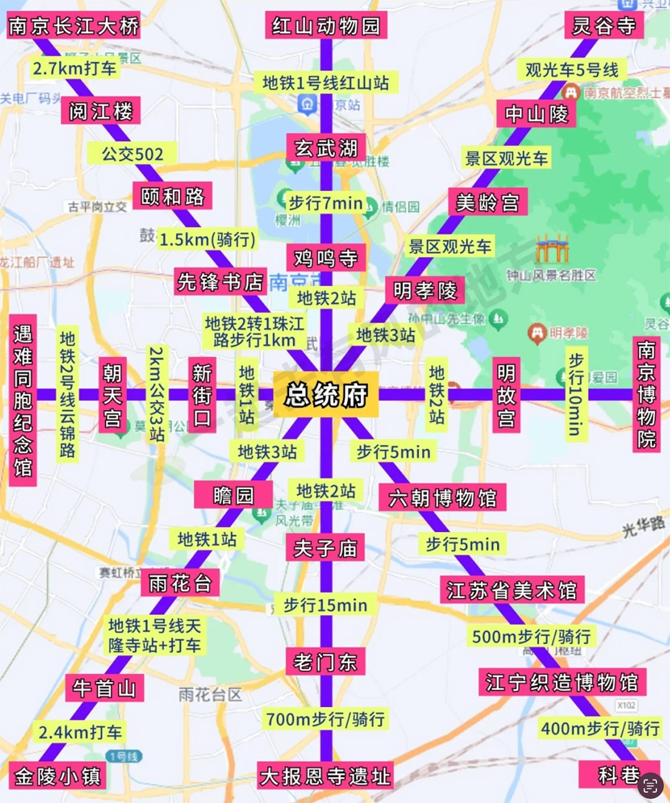

>  [首页](../README.md)

---

> 18-20 南京 21-22 湖州 22或者23返程 具体看机票时间，再决定22晚上还是23

> 19-21 南京 22-23湖州 24返程

#### 第一天（11.19）
> 总统府->[夫子庙](#夫子庙)->老门东->大报恩寺遗址
#### 第二天（11.20）
> [钟山风景区](#钟山风景区)
#### 第三天（11.21）
> 南京->湖州
#### 第四天（11.22）
> 南浔古镇
#### 第五天（11.23）

----- 

#####  天气预报
+ ☁️[南京](http://hunan.promotion.weather.com.cn/mweather15d/101190101.shtml)
+ ☁️[湖州](http://hunan.promotion.weather.com.cn/mweather15d/101210201.shtml)

##### 🥘美食推荐

##### 🎫景点门票

----- 

#### 南京景点图

#### 夫子庙
+ [地图路线图](../topwrite/assets/地图|景区图/南京/IMG_9663.jpg)
+ [景点路线图](../topwrite/assets/地图|景区图/南京/夫子庙路线.jpg)
+ 🏞︎[东水关遗址公园](https://map.baidu.com/poi/%E4%B8%9C%E6%B0%B4%E5%85%B3%E9%81%97%E5%9D%80%E5%85%AC%E5%9B%AD/@13225486.00518269,3744272.1480671163,18.86z?uid=88c9033e9b1b17daaf31e5ea&ugc_type=3&ugc_ver=1&device_ratio=2&compat=1&pcevaname=pc4.1&querytype=detailConInfo&da_src=shareurl) --`步行约2分钟`--> 🏛️[吴敬梓纪念馆](https://map.baidu.com/poi/%E5%90%B4%E6%95%AC%E6%A2%93%E7%BA%AA%E5%BF%B5%E9%A6%86/@13225163.963782107,3744286.51610885,19z?uid=50a45ae4269ca867bea2403e&ugc_type=3&ugc_ver=1&device_ratio=2&compat=1&pcevaname=pc4.1&querytype=detailConInfo&da_src=shareurl) --`步行约1分钟`--> 🏘️[故桃叶渡](https://map.baidu.com/poi/%E5%8F%A4%E6%A1%83%E5%8F%B6%E6%B8%A1/@13224985.958954377,3745005.459252023,14.42z?uid=faebb2f474acf713b05c6a74&ugc_type=3&ugc_ver=1&device_ratio=2&compat=1&pcevaname=pc4.1&querytype=detailConInfo&da_src=shareurl) --`步行约4分钟`--> 🌉[东园桥](https://map.baidu.com/poi/%E4%B8%9C%E5%9B%AD%E6%A1%A5/@13224829.93120653,3744085.3141342415,18.95z?uid=550fd5f9a6304a79921fc9a6&ugc_type=3&ugc_ver=1&device_ratio=2&compat=1&pcevaname=pc4.1&querytype=detailConInfo&da_src=shareurl) --`步行约6分钟`--> 🌉[文德桥](https://map.baidu.com/poi/%E6%96%87%E5%BE%B7%E6%A1%A5/@13224412.309999999,3743847.42,19z?uid=dfc496b6cf9dc8af8836eea9&ugc_type=3&ugc_ver=1&device_ratio=2&compat=1&pcevaname=pc4.1&querytype=detailConInfo&da_src=shareurl) --`步行约1分钟`--> 🏬[得月台小吃](https://map.baidu.com/poi/%E5%BE%97%E6%9C%88%E5%8F%B0%E5%B0%8F%E5%90%83/@13224382.285,3743863.48,19z?uid=378020964f8449eb2dfaa7fa&ugc_type=3&ugc_ver=1&device_ratio=2&compat=1&pcevaname=pc4.1&querytype=detailConInfo&da_src=shareurl) 

#### 钟山风景区
+ [地图路线图](../topwrite/assets/地图|景区图/南京/IMG_9662.jpg)
+ [景点路线图](../topwrite/assets/地图|景区图/南京/钟山风景区路线.jpg)
+ 🚇[钟灵街（1号口）](https://map.baidu.com/poi/%E9%92%9F%E7%81%B5%E8%A1%97%E5%9C%B0%E9%93%81%E7%AB%99-1%E5%8F%A3/@13233412.325,3746436.13,19z?uid=05352a2ed14b7f6528201a77&ugc_type=3&ugc_ver=1&device_ratio=2&compat=1&pcevaname=pc4.1&querytype=detailConInfo&da_src=shareurl) --`步行约22分钟`--> 🕌[灵谷寺路](https://map.baidu.com/search/%E7%81%B5%E8%B0%B7%E5%AF%BA%E8%B7%AF-%E9%81%93%E8%B7%AF/@13232824.185,3747732,19z?querytype=s&da_src=shareurl&wd=%E7%81%B5%E8%B0%B7%E5%AF%BA%E8%B7%AF-%E9%81%93%E8%B7%AF&c=315&src=0&wd2=%E5%8D%97%E4%BA%AC%E5%B8%82&pn=0&sug=1&l=19&b=(13233167.325,3745905.88;13233657.325,3746966.38)&from=webmap&biz_forward=%7B%22scaler%22:2,%22styles%22:%22pl%22%7D&sug_forward=4a0d5104ba7b9a549c82ea2f&device_ratio=2) --`步行约17分钟`--> 🏛️[南京音乐台](https://map.baidu.com/search/%E9%92%9F%E5%B1%B1%E9%A3%8E%E6%99%AF%E5%8C%BA-%E5%8D%97%E4%BA%AC%E9%9F%B3%E4%B9%90%E5%8F%B0/@13231676.515412724,3748388.7950052,18.98z?querytype=s&da_src=shareurl&wd=%E9%92%9F%E5%B1%B1%E9%A3%8E%E6%99%AF%E5%8C%BA-%E5%8D%97%E4%BA%AC%E9%9F%B3%E4%B9%90%E5%8F%B0&c=315&src=0&wd2=%E5%8D%97%E4%BA%AC%E5%B8%82%E7%8E%84%E6%AD%A6%E5%8C%BA&pn=0&sug=1&l=19&b=(13232579.185,3747201.75;13233069.185,3748262.25)&from=webmap&biz_forward=%7B%22scaler%22:2,%22styles%22:%22pl%22%7D&sug_forward=750ec1651ff1732b4c3a59ec&device_ratio=2) --`步行约1分钟`--> 🏞️[中山陵景区](https://map.baidu.com/search/%E4%B8%AD%E5%B1%B1%E9%99%B5%E6%99%AF%E5%8C%BA/@13231261.454384303,3748437.89388705,15.39z?querytype=s&da_src=shareurl&wd=%E4%B8%AD%E5%B1%B1%E9%99%B5%E6%99%AF%E5%8C%BA&c=315&src=0&pn=0&sug=0&l=13&b=(13216006.799637903,3728189.1211094577;13235456.746401597,3770284.3630337417)&from=webmap&biz_forward=%7B%22scaler%22:2,%22styles%22:%22pl%22%7D&device_ratio=2) --`步行约21分钟`，途径**梧桐大道九号**--> 🏰[美龄宫](https://map.baidu.com/poi/%E7%BE%8E%E9%BE%84%E5%AE%AB/@13230814.014716651,3747177.74619355,19z?uid=af9c649a5b598b359ff77904&ugc_type=3&ugc_ver=1&device_ratio=2&compat=1&pcevaname=pc4.1&querytype=detailConInfo&da_src=shareurl) --`步行约6分钟`--> 🏞️[明孝陵景区5号门](https://map.baidu.com/poi/%E6%98%8E%E5%AD%9D%E9%99%B5%E6%99%AF%E5%8C%BA-5%E5%8F%B7%E9%97%A8/@13230321.725,3747277.73,19z?uid=86c002c96c5f792f9cf779b1&ugc_type=3&ugc_ver=1&device_ratio=2&compat=1&pcevaname=pc4.1&querytype=detailConInfo&da_src=shareurl) --`步行约6分钟`,途径**梧桐大道**--> 🚇[苜蓿园站](https://map.baidu.com/search/%E8%8B%9C%E8%93%BF%E5%9B%AD-%E5%9C%B0%E9%93%81%E7%AB%99/@13229508.284999998,3746463.4,19z?querytype=s&da_src=shareurl&wd=%E8%8B%9C%E8%93%BF%E5%9B%AD-%E5%9C%B0%E9%93%81%E7%AB%99&c=315&src=0&wd2=%E5%8D%97%E4%BA%AC%E5%B8%82%E7%8E%84%E6%AD%A6%E5%8C%BA&pn=0&sug=1&l=15&b=(13227194.651183663,3742573.893366043;13232510.20476584,3754078.2700474667)&from=webmap&biz_forward=%7B%22scaler%22:2,%22styles%22:%22pl%22%7D&sug_forward=7df885f4963d1f271fe999ed&device_ratio=2)

#### ✨门票🎫
+ 音乐台 💰10
+ 美龄宫 💰30

-----
