>  [首页](../README.md)

---

# 【周日限定】惠州惠阳区自驾一日游攻略 🌄
**关键词**：客家文化深度体验 | 亲子生态 | 周末市集 | 落日秘境

---

## 📍 行程概览

```mermaid
gantt
    title 周日时间轴（8:30-21:00）
    dateFormat  HH:mm
    section 上午
    秋长客家文化探索       :08:30, 2h
    茶园采摘体验          :10:30, 90m
    午餐（窑鸡盛宴）       :12:00, 90m
    section 下午
    亚公顶轻徒步          :13:30, 120m
    水库野趣时光          :15:30, 90m
    老城漫游              :17:00, 90m
    section 夜晚
    夜市晚餐+音乐喷泉      :18:30, 150m
```



---

## 🚗 分段详解

### 1️⃣ 08:30 秋长谷里（客家文化旗舰站）
- **导航**：`秋长谷里文化旅游区停车场`（免费）
- **周日特别活动**：
  - 🎭 09:00-10:00 会水楼客家山歌表演（每周日限定）
  - 🛠️ 10:00-10:30 吉他工坊亲子DIY（98元/家庭，需提前1天预约）
- **摄影点**：粮仓改造的书局旋转楼梯、稻田观景台

### 2️⃣ 10:30 碧桂园润杨溪谷（生态绿洲）

```geojson
{
  "type": "FeatureCollection",
  "features": [
    {
      "type": "Feature",
      "geometry": {
        "type": "Point",
        "coordinates": [
          [114.516372,22.788154], // 茶园入口
          [114.518029,22.785641], // 观景台
          [114.520883,22.786597]  // 竹林秘境出口
        ],
      },
      "properties": {
        "name": "茶园秘境路线"
      }
    }
  ]
}
```

```geojson
{
  "type": "Feature",
  "properties": {
    "name": "茶园秘境路线"
  },
  "geometry": {
    "coordinates": [
      [114.516372,22.788154], // 茶园入口
      [114.518029,22.785641], // 观景台
      [114.520883,22.786597]  // 竹林秘境出口
    ],
    "type": "LineString"
  }
}
```

- **体验项目**：
  - 🌿 采茶体验（赠100g自采茶叶）
  - 🍵 客家擂茶制作（亲子套餐128元）

### 3️⃣ 12:00 永湖镇窑鸡宴

| 店家 | 招牌菜 | 人均 | 预约方式  |
|----|----|----|----|
| 老车田农庄 | 荔枝木窑鸡 | 65元 | 136xxxxxxxx  |
| 乡野土灶 | 柴火焖鹅+艾糍 | 55元 | 无需预约  |

---

### 4️⃣ 13:30 亚公顶森林公园（轻量徒步）
- **路线选择**：
  - 👨👩👧👦 亲子线：东门→观景台（40分钟往返）
  - 🚶♂️ 深度线：西门→野生荔枝林环线（2小时）
- **必备装备**：
  + 防滑运动鞋（部分石阶有青苔）
  - 勿穿短裤（蚊虫较多）

### 5️⃣ 15:30 吊钟水库（野餐模式）
- **物资清单**：
  - 🧺 野餐垫（建议选择西南岸草地）
  - 🎣 简易钓具（限手竿，禁止商业捕捞）
  - 🦟 驱蚊液（必备！）
- **隐秘打卡点**：废弃水文站红砖墙（出片率100%）

---

### 6️⃣ 17:00 淡水老街探秘
**周日市集特别路线**：
```
邓承修故居 → 猪行街（手作文创市集） → 桥头市场（18:00海鲜晚市）
```
- **必买手信**：
  - 🎁 秋长客家凉帽（手工编织款80-150元）
  - 🍯 淡水鱼露（桥头市场13号铺）

### 7️⃣ 18:30 沙田世外梅园（夜宴）
- **周日限定菜**：
  - ✅ 梅子酒焗虾（时令特供）
  - ✅ 月光宝盒（客家九大簋mini版）
- **夜间彩蛋**：19:00后开启梅林灯光秀（免费参观）

---

## ⚠️ 周日特别提示
```diff
! 交通管制：
+ 淡水人民路（17:00-19:00）步行街化，车辆需绕行
- 亚公顶停车场10:00后常满，建议停南门私人停车场（10元/次）

! 消费预警：
+ 桥头市场海鲜晚市可砍价（参考价：皮皮虾35元/斤）
- 慎买老街流动摊贩的"古董"
```

---

<details>
<summary>📲 应急联络表（点击展开）</summary>

| 场景        | 联系方式            |
|-------------|-------------------|
| 车辆紧急救援  | 李师傅 135XXXXXX88 |
| 景区投诉     | 惠阳文旅局 0752-337XXXX |
| 夜间门诊     | 惠阳中医院 24小时急诊 |
</details>
```

---

✅ **文档使用说明**：  
1. 长按地图坐标可复制到导航软件  
2. 周日活动建议提前1天电话确认  
3. 表格数据更新至2024年7月  

🔍 **深度需求**：如需生成可导航的KMZ地图文件，可留言告知！
