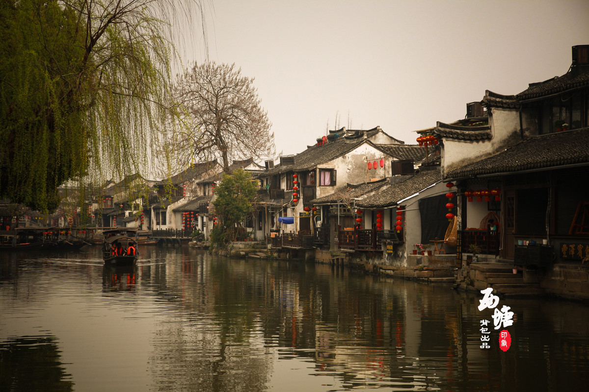
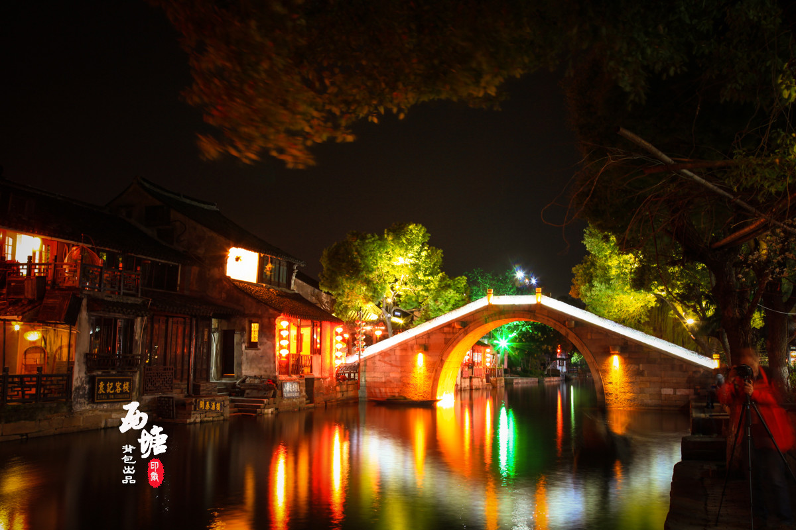

## 西塘 | 活着的千年古镇

> 位于浙江嘉兴的西塘虽然在六大古镇里建镇时间算比较短的一个，但它是其中最大的古镇。阿汤哥在白墙黛瓦间的跳跃穿梭，把这里随同《谍中谍3》一起展现在了世人的眼前。直至今日，西塘仍然保存着完整的明清代古建筑，尤其是廊棚和古弄堪称“双绝”，在诸多江南水乡古镇中可谓难得一见，因此被称作“活着的千年古镇”。古镇薄雾似纱，两岸白墙墨顶，瓦屋倒影，舟影波光，偶路一个院子门口，酒香飘溢，让人总忍不住羡慕这些寻常巷陌里的寻常人家。
> * **代表作**：《碟中谍3》、《我的青春谁做主》、《五星大饭店》、《像雾像雨又像风》
>* **著名景点**：卧龙桥、五福桥、送子来凤桥、安境桥、石皮弄、烟雨长廊
>* **当地特产**：嘉善黄酒、荷叶粉蒸肉、八珍糕、芡实糕、芡实糕

> * **地址**：浙江省嘉兴市嘉善县西塘镇南苑路258号