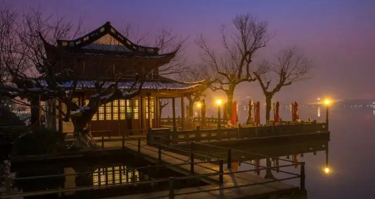
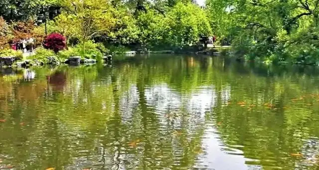
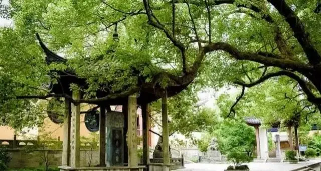

**西湖景点有苏堤春晓、雷峰夕照、柳浪闻莺、平湖秋月、花港观鱼、曲院风荷、双峰插云、三潭印月、南屏晚钟、断桥残雪等。**

### **苏堤春晓** 
>苏堤连接了南山和北山，给西湖增添了一道妩媚的风景线，且花木一年四季姹紫嫣红，五彩缤纷，如诗若画的迷人风光，成了人们长年游玩的好地方。
* 最佳观赏时间：3-5月

### **雷峰夕照**
>位于西湖南岸夕照山上的雷峰塔，相传为吴越王为庆黄妃得子而建的，故初名”黄妃塔”，但民间因塔在雷峰，均呼之为雷峰塔，每当夕阳西下，塔影横空，别有一番景色，故被称为“雷峰夕照"。
* 最佳观赏时间：四季均可

### **柳浪闻莺**
>其间黄莺飞舞，竞相啼鸣，故有“柳浪闻莺”之称，只见处处柳树成荫，恬静淡雅，公园内有很多景点，比如闻莺阁、肖公桥、三训堂等。
* 最佳观赏时间：3-5月

### **平湖秋月**
>平湖秋月位于白堤西端，濒临外西湖，此地商阁凌波，绮窗俯水，平台宽方，视野开阔，中秋之夜，月白风清，湖水盈盈，坐在平台茶座上，仰看天上月轮当空，俯视湖中月影倒映，天上、湖中两圆月，交相辉映，有使人如入方寒宫之感。
* 最佳观赏时间：9-11月

### **花港观鱼**
>地处西湖西南，三面临水，一面倚山，有一条清溪流经此处注入西湖，故称花港。南宋时，内侍卢允升在花家山下建造别墅，称“卢园”，园内栽花养鱼，池水清冽、景物奇秀。
* 最佳观赏时间：6-8月

### **曲院风荷**
>每当夏日，荷花开放，满眼翠盖红妆，香飘数里，池和池之间筑小桥相连，便于游人流连观赏，可以领略到“接天莲叶无穷碧，映日荷花别样红”的迷人景色。
* 最佳观赏时间：6-8月

### **双峰插云**
>双峰指的是南高峰和北高峰，两峰遥相对峙，相去十余里，中间的小山起伏，婉蜒盘结，春秋雨日，从湖西北眺望，浮云浓如远山，远山淡如浮云，峰顶时隐时现于薄雾轻岚之中，望之如插云天。
* 最佳观赏时间：四季均可

### **三潭印月**
>三潭印月是西湖中最大的岛屿，风景秀丽、景色清幽，尤三潭印明月的景观享誉中外，西湖三岛中最大的岛，面积约7万平方米，其中水面占60%，到了清代，又在东西连柳堤，南北建黄桥，使全岛呈“田“字形，形成“湖中有岛、岛中有湖”的格局，宛如仙山琼岛，因而又称“小瀛州"。
* 最佳观赏时间：四季均可

### **南屏晚钟**
>南屏山横亘于西湖南岸，山上林木苍翠，秀石玲珑，寺院原有铜钟一口，每天傍晚，深沉、浑厚的钟声在苍烟暮露中回响，山回谷鸣，发人悠远的沉思。
* 最佳观赏时间：四季均可

### **断桥残雪** 
>许多人把断桥选做游玩西湖的起点，从断桥上白堤，去到孤山，而后依次游玩西湖周边的各个景点，断桥上的视野不错，很多人在桥上拍西湖的景色，夏天断桥靠近北山路的一侧满是荷花，在桥头的小亭子附近以荷花为前景拍断桥全景非常美。
* 最佳观赏时间：12月-2月

